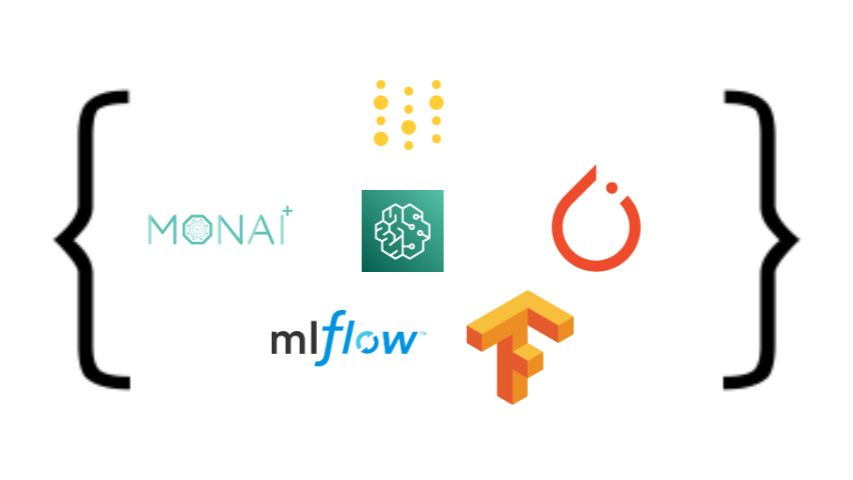

# Migrating Medical Imaging Training from EC2 to Amazon SageMaker

End-to-end examples for migrating medical image classification and segmentation workloads from EC2 to Amazon SageMaker, covering data preprocessing, distributed training, experiment tracking, and production deployment.



## Overview

This repository contains two progressive workshop tracks:

1. **Medical Image Classification** - Migrate a DenseNet121 spine X-ray classifier from EC2 to SageMaker (Script Mode, BYOC, MLflow, async deployment)
2. **Medical Image Segmentation** - Train 3D MONAI models (SegResNet, SwinUNETR) on SageMaker with single-GPU, FSDP multi-GPU, HPO, and async endpoints with scale-to-zero

## Repository Structure

```
.
├── config.yaml                           # Public config template (placeholders)
├── run.py                                # CLI: train/deploy/invoke/cleanup
├── run_notebook.py                       # Run a single notebook with config injected
├── run_all_notebooks.py                  # Run all notebooks end-to-end
├── Makefile                              # Test targets
├── pytest.ini                            # Test configuration
├── tests/                                # Pytest integration tests
├── medical-image-classification/
│   └── notebooks/
│       ├── 00_ec2_training/              # Baseline EC2 training
│       ├── 01_data_preprocessing/        # SageMaker Processing
│       ├── 02_sm_script_mode/            # SageMaker Script Mode
│       ├── 03_sagemaker_byoc/            # Bring Your Own Container
│       ├── 04_sagemaekr_byoc_mlflow/     # BYOC + MLflow tracking
│       └── 05_sagemaker_deployment/      # Async + realtime endpoints
└── medical-image-segmentation/
    ├── code/
    │   ├── training/                     # Training scripts (simple, FSDP, DDP)
    │   ├── models/                       # Model definitions (SegResNet, SwinUNETR)
    │   └── scripts/                      # IAM role helper, build scripts
    └── notebooks/
        ├── lab1_single_gpu_training.ipynb
        ├── lab2_fsdp_multi_gpu.ipynb
        ├── lab3_wandb_experiment_tracking.ipynb
        ├── lab4_ddp_unified_tracking.ipynb
        ├── lab5_hyperparameter_optimization.ipynb
        ├── lab6_nnunet_pipeline.ipynb
        ├── lab7_model_deployment.ipynb
        └── deploy/                       # Inference scripts for endpoints
```

## Prerequisites

- AWS account with SageMaker access
- IAM role with `AmazonSageMakerFullAccess` and `AmazonS3FullAccess`
- S3 bucket for data and model artifacts
- Python 3.10+
- Docker (for BYOC notebooks)
- AWS CLI configured (`aws configure`)

## Quick Start

### 1. Clone and configure

```bash
git clone <repository-url>
cd sample-migration-of-training-medical-imaging-modes-from-ec2-to-sagemaker

# Create your private config (gitignored)
cp config.yaml config_pvt.yaml
```

Edit `config_pvt.yaml` with your values:

```yaml
aws:
  region: us-east-1
  account_id: "123456789012"
  sagemaker_role: "YourSageMakerRole"
  s3_bucket: "your-bucket-name"

segmentation:
  data_s3: "s3://your-bucket/segmentation_data/"
  model_s3: ""   # Set after training
  test_nifti_s3: "s3://your-bucket/segmentation_data/test/subject_01/img.nii.gz"

classification:
  data_s3: "s3://your-bucket/classification_data/"
  model_s3: ""   # Set after training
```

### 2. Verify your AWS setup

```bash
pip install -r tests/requirements.txt
make test-cheap
```

This validates IAM role, S3 access, and SageMaker API connectivity without launching any resources.

### 3. Run notebooks or use the CLI

**Option A: Run notebooks** (step-by-step, with explanations)

```bash
pip install papermill pyyaml

# Run a single notebook
python run_notebook.py medical-image-segmentation/notebooks/lab1_single_gpu_training.ipynb

# Run all segmentation notebooks
python run_all_notebooks.py --seg

# Run all classification notebooks
python run_all_notebooks.py --cls
```

**Option B: Use the CLI** (fast, no notebooks)

```bash
python run.py train-segmentation
python run.py deploy-segmentation
python run.py invoke-segmentation s3://your-bucket/scans/patient_01.nii.gz
python run.py cleanup-segmentation
```

## Running Notebooks

Notebooks on GitHub contain placeholders (`YOUR_BUCKET_NAME`, `YOUR_TRAINING_JOB`, etc.) so they are safe to share. The runner scripts inject your real values from `config_pvt.yaml` at runtime without modifying the source files.

```bash
# Preview what substitutions will be applied
python run_notebook.py --dry-run medical-image-segmentation/notebooks/lab7_model_deployment.ipynb

# Run a single notebook (output saved to ./notebook_outputs/)
python run_notebook.py medical-image-segmentation/notebooks/lab1_single_gpu_training.ipynb

# Run all notebooks
python run_all_notebooks.py

# Run only segmentation or classification
python run_all_notebooks.py --seg
python run_all_notebooks.py --cls

# Skip specific notebooks
python run_all_notebooks.py --skip lab6 wandb

# Stop on first failure
python run_all_notebooks.py --stop-on-failure
```

Executed notebooks with outputs are saved to `notebook_outputs/` (gitignored).

## CLI Runner (`run.py`)

A command-line tool that runs the full pipeline without opening notebooks. Reads all parameters from `config_pvt.yaml` (auto-detected) or specify with `--config`.

```bash
python run.py setup-role                       # Create/verify IAM role
python run.py status                           # Check all endpoint status

# Segmentation
python run.py train-segmentation               # Launch training job
python run.py deploy-segmentation              # Deploy async endpoint
python run.py invoke-segmentation <s3_uri>     # Run inference on NIfTI file
python run.py cleanup-segmentation             # Delete endpoint + resources

# Classification
python run.py train-classification             # Launch training job
python run.py deploy-classification            # Deploy async endpoint
python run.py invoke-classification <s3_uri>   # Classify a DICOM image
python run.py cleanup-classification           # Delete endpoint + resources
```

Config priority: `config_pvt.yaml` > `config.local.yaml` > `config.yaml`

Environment variables override config values (useful for CI):

| Env Variable | Config Key |
|---|---|
| `AWS_DEFAULT_REGION` | `aws.region` |
| `AWS_SAGEMAKER_ROLE` | `aws.sagemaker_role` |
| `SEGMENTATION_DATA_S3` | `segmentation.data_s3` |
| `SEGMENTATION_MODEL_S3` | `segmentation.model_s3` |
| `CLASSIFICATION_DATA_S3` | `classification.data_s3` |
| `WANDB_API_KEY` | `tracking.wandb_api_key` |

## Workshop 1: Medical Image Classification

Progressive migration from EC2 to production SageMaker deployment.

| Lab | Topic | Instance | Duration |
|-----|-------|----------|----------|
| 00 | EC2 baseline training | local GPU | 30 min |
| 01 | Data preprocessing (SageMaker Processing) | ml.m5.xlarge | 45 min |
| 02 | SageMaker Script Mode | ml.g5.xlarge | 45 min |
| 03 | Bring Your Own Container | ml.g5.xlarge | 60 min |
| 04 | BYOC + MLflow tracking | ml.g5.xlarge | 60 min |
| 05 | Async + realtime deployment | ml.g5.xlarge | 45 min |

**Dataset:** Spine X-ray classification (8 classes: disc narrowing, osteophytes, spondylolisthesis, etc.)

## Workshop 2: Medical Image Segmentation

Production-scale 3D medical image segmentation with MONAI.

| Lab | Topic | Instance | Duration |
|-----|-------|----------|----------|
| 1 | Single GPU training (SegResNet) | ml.g5.xlarge | 30 min |
| 2 | Multi-GPU FSDP | ml.g5.12xlarge | 45 min |
| 3 | Weights & Biases tracking | ml.g5.xlarge | 30 min |
| 4 | DDP + unified tracking | ml.g5.12xlarge | 45 min |
| 5 | Hyperparameter optimization | multiple | 60+ min |
| 6 | nnU-Net pipeline | ml.g5.xlarge | 60 min |
| 7 | Async endpoint + scale-to-zero | ml.g5.xlarge | 45 min |

**Dataset:** 3D CT/MRI volumes (NIfTI format) for organ segmentation.

## Testing

```bash
# Install test dependencies
make install

# Quick validation (no AWS resources created)
make test-smoke          # Notebook structure, syntax, imports
make test-cheap          # AWS connectivity + permissions check

# Full integration (creates real resources — costs money)
make test-training       # Launch training jobs
make test-deployment     # Deploy endpoints
make test-all            # Everything
```

Test tiers:

| Target | What it checks | Cost |
|--------|----------------|------|
| `test-smoke` | Notebook JSON valid, Python syntax, expected files exist | Free |
| `test-cheap` | IAM role, S3 access, SageMaker API connectivity | ~$0 |
| `test-training` | Launches real training jobs | $$ (GPU hours) |
| `test-deployment` | Deploys real endpoints | $$ (GPU hours) |

## Cost Optimization

| Strategy | Savings | How |
|----------|---------|-----|
| Warm pools | ~50% startup time | `keep_alive_period_in_seconds=1800` |
| Spot instances | Up to 70% | `use_spot_instances=True` |
| Scale-to-zero | Pay only when invoked | Async endpoint + auto-scaling min=0 |
| Right-sizing | Varies | Use ml.g5.xlarge for dev, scale up for production |

**Instance reference:**

| Instance | GPUs | GPU Memory | Cost/Hour | Use Case |
|----------|------|------------|-----------|----------|
| ml.g5.xlarge | 1x A10G | 24 GB | ~$1.41 | Dev, single model training |
| ml.g5.2xlarge | 1x A10G | 24 GB | ~$1.52 | Larger batch sizes |
| ml.g5.12xlarge | 4x A10G | 96 GB | ~$7.09 | Multi-GPU FSDP/DDP |
| ml.g4dn.12xlarge | 4x T4 | 64 GB | ~$4.89 | Budget multi-GPU |

## Troubleshooting

**OOM errors:** Reduce batch_size, enable mixed precision, or switch to FSDP for multi-GPU sharding.

**Slow training:** Increase batch_size, use multi-GPU instances, optimize `num_workers` in DataLoader.

**S3 permission errors:** Verify IAM role has S3 access and the bucket policy allows the SageMaker role.

**Container failures:** Test locally with `docker run -it <image> /bin/bash`, then check CloudWatch logs for the training job.

**Cold start on endpoints:** Async endpoints with scale-to-zero take 8-12 minutes to warm up. Set `MinCapacity=1` if latency matters.

## License

This project is licensed under the MIT License. See [LICENSE](LICENSE).

## Acknowledgments

Built with [Amazon SageMaker](https://aws.amazon.com/sagemaker/), [PyTorch](https://pytorch.org/), [MONAI](https://monai.io/), [MLflow](https://mlflow.org/), and [Weights & Biases](https://wandb.ai/).
